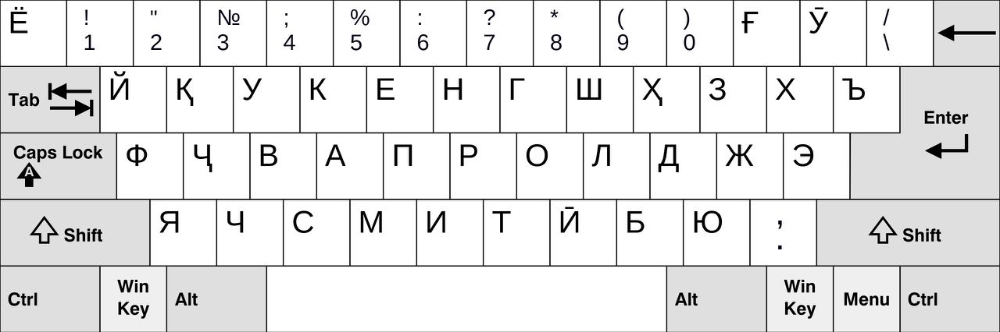

# Спеллчекер для таджикского

## Данные

Из-за того, что для таджикского не существует корпуса ошибок, мы создали ошибочный датасет искуственно. Это включало в себя:

1. Сбор статистики по ошибкам для русского с предположением, что данные характеристики ошибок более или менее универсальные (место, тип ошибки, количество ошибок в слове) `
statistics_position_and_type_of_mistakes.py`
2. Построение клавиатурных расстояний на основе расскладки qwerty для таджикского п(мы можем исправлять только опечатки, исправление орфографических ошибок возможно при условии наличия корпуса ошибок), при этом знакам с диакритикам и их аналогам без таковых вне зависимости от рельного расстояния приписано расстояние 1, необходимость такого выявилась при анализе ошибок для val_set'а  - `utils.py` и `qwerty_positions.py`

3. Создание двух датасетов: с рандомным внесением ошибок и со статистически обоснованным, датасеты создавались на основе [очищенного таджикского подкорпуса Лейпцигского корпуса](https://huggingface.co/datasets/muhtasham/tajik-corpus). Датасеты и валидационный сет лежат [здесь](https://disk.yandex.ru/d/iC8xJbFjQeIKyA) - `
generate_dataset.py`
4. Создание валидационного сета. Из-за того, что корпуса ошибок для таджикского не существует, валидационный сет извлекался из первоначального корпуса. Была собрана статистика по частотности слов, и при использовании статистики встречаемости ошибок относительно употребления правильного слова на основе русского корпуса был установлен **порог** встречаемости. Ошибкой относительно некоторого слова (с опуском некоторых эмпирик, связанных с морфологическим строем таджикского) считалось слово, которое встречалось в **порог**/2 (для надежности) и меньше раз меньше, чем слово с расстоянием Левенштейна 1 от него - `form_val_error_set.py` и `generate_val_sentences_set.py`

## Архитектура
Использовалась архитектура [Soft Masked Bert](https://arxiv.org/abs/2005.07421), показавшая хороший перформанс на данных для японского языка. На вход она способна принимать относительно небольшой контекст (одно предлежение), производить как детекцию, так и коррекцию ошибок спеллинга. Оптимизируются лоссы для обеих задач, можно изменять коэффициенты, с которыми они суммируются.

## Оценка 

Для оценки использовалось выравнивание Левенштейна по группам. Кроме того, для сравнения использовали спеллчекер Норвига, основанный на статистике первоначального корпуса

